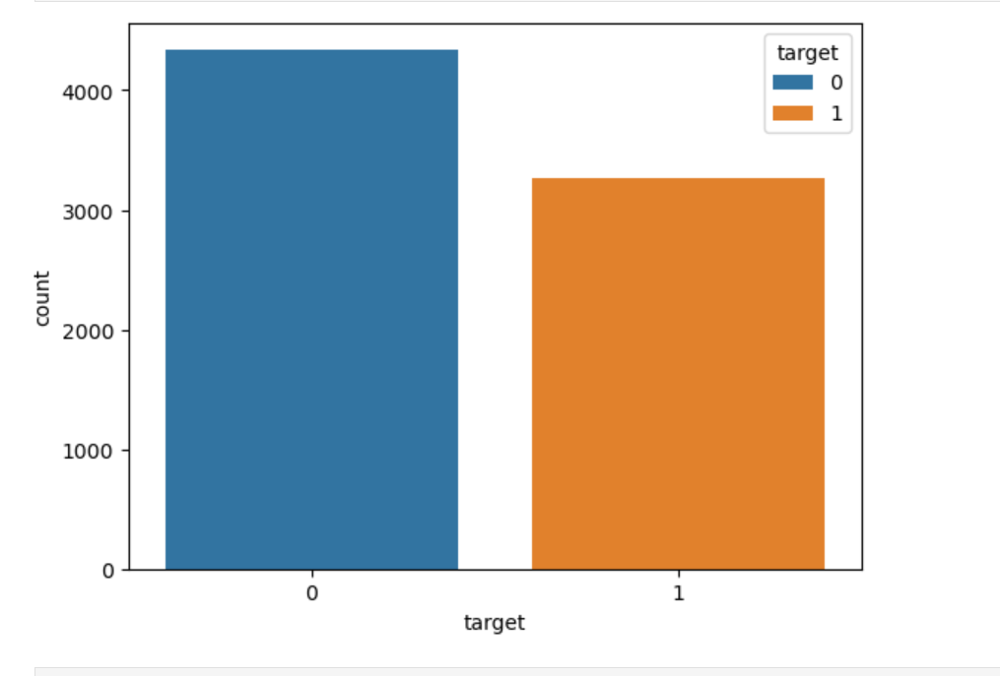
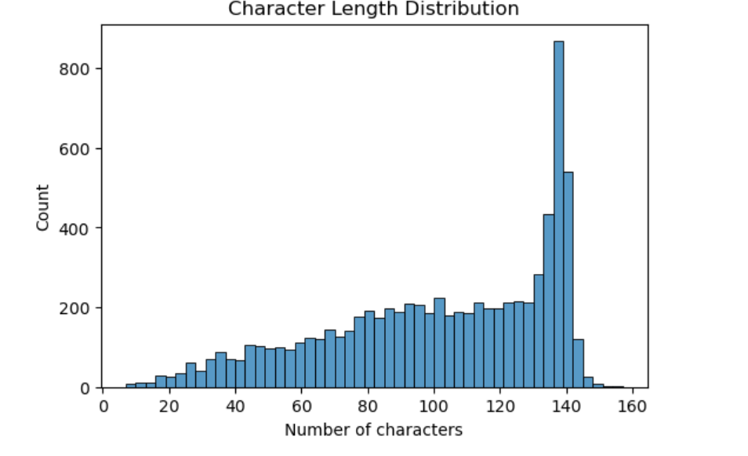
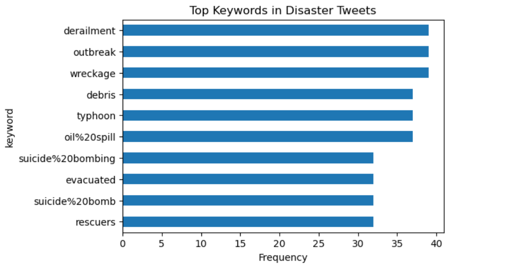

## 🚨 NLP Disaster Tweet Classifier — TF-IDF + Logistic Regression

A production-ready NLP text classification project that detects whether a tweet describes a real disaster event or not — deployed as an interactive Streamlit app.

Built as a fast, explainable classical ML baseline using TF-IDF and Logistic Regression with threshold tuning.
This app classifies tweets as **Disaster (1)** or **Non-Disaster (0)**.

## 🔗 Live Demo & Code

🤗 HuggingFace Space: [https://huggingface.co/spaces/EnYa32/NLPDisasterTweets]

💻 GitHub Repository: [https://github.com/EnYa32/NLPDisasterTweets]

📓 Kaggle Competition: [https://www.kaggle.com/code/enesyama/nlp-disastertweets]

## What this project does
Many tweets contain disaster-related words but do not describe real disasters.  
This project trains a classical NLP model to detect real disaster tweets.
Many tweets contain disaster-related keywords (fire, flood, explosion) but are used in a metaphorical or casual context.

Goal:
Build a model that distinguishes:

1 = real disaster event
0 = non-disaster tweet

## Model
- **Text features:** TF-IDF (unigrams + bigrams)
- **Classifier:** Logistic Regression
- **Metric:** F1-score
- **Threshold tuning:** optimized on validation set (**threshold = 0.43**)
- Best validation F1-score: **~0.78**

## 📊 EDA Visualizations

## NLP Preprocessing Pipeline

Applied consistently in training and inference:

lowercase

punctuation removal

whitespace normalization

keyword + location enrichment

TF-IDF transform

## Files in this repo
Place these files in the repository root:
- app.py
- final_clf.pkl (trained pipeline: TF-IDF + Logistic Regression)
- threshold.pkl (float threshold, e.g. 0.43)
- requirements.txt
- README.md

## ▶️ Run Locally
pip install -r requirements.txt
streamlit run app.py

Notes
This is a classical ML baseline (fast + strong).

The same artifacts can be reused in any deployment setting.
